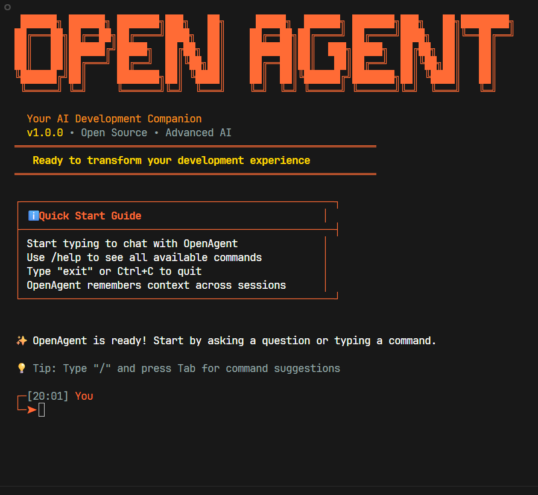

<div align="center">
  
  
  # OpenAgent
  
  **Open-source AI development assistant with advanced project analysis capabilities**
  
  [](https://github.com/RaheesAhmed/OpenAgent/stargazers)
  [](https://github.com/RaheesAhmed/OpenAgent/network)
  [](LICENSE)
  [](https://www.typescriptlang.org/)
  
  
  
</div>

## Table of Contents

- [Overview](#overview)
- [Project Stats](#project-stats)
- [Key Features](#key-features)
- [Quick Start](#quick-start)
- [Architecture](#architecture)
- [Core Systems](#core-systems)
  - [CLI Layer](#cli-layer)
  - [Agent System](#agent-system)
  - [Memory System](#memory-system)
  - [Project Analysis Engine](#project-analysis-engine)
  - [Token Optimization](#token-optimization)
  - [Code Validation](#code-validation)
  - [MCP Integration](#mcp-integration)
- [Tools System](#tools-system)
  - [Project Analysis Tools](#project-analysis-tools)
  - [File System Tools](#file-system-tools)
  - [Terminal Tools](#terminal-tools)
- [Command Reference](#command-reference)
- [Configuration](#configuration)
- [Development](#development)
- [Performance & Metrics](#performance--metrics)
- [Contributing](#contributing)
- [License](#license)

## Overview

OpenAgent is a TypeScript-based AI development assistant that provides intelligent project analysis, persistent memory, and extensible tool integration. Built on LangChain/LangGraph framework with support for multiple AI models.

> **Note**: This project was previously named "OpenClaude" and has been rebranded to "OpenAgent" for trademark compliance.

## Project Stats

- **Files**: 29 total files (22,350 lines of code)
- **Languages**: TypeScript, Text/Config files
- **Dependencies**: 38 packages including Anthropic SDK, LangChain, SQLite3
- **Architecture**: Modular, event-driven system with clear separation of concerns

## Key Features

### 🧠 **Intelligent Systems**
- **Project Analysis**: Automated codebase analysis with dependency mapping
- **Persistent Memory**: SQLite-based storage with semantic search
- **Context Management**: Token-aware context sizing for API optimization
- **Smart Caching**: Intelligent caching of frequently used content

### ⚡ **Performance & Optimization**
- **Token Optimization**: 40%+ cost savings through intelligent compression  
- **Background Processes**: Automatic optimization and cleanup
- **Memory Efficient**: Minimal footprint even for large projects
- **Real-time Streaming**: Professional UI with live updates

### 🛠️ **Development Tools**
- **Multi-thread Conversations**: Separate conversation contexts
- **Code Validation**: Multi-layer quality checking (syntax, security, performance)
- **MCP Integration**: Model Context Protocol support for extensible functionality
- **Slash Commands**: Quick access to functionality

### 🔧 **Technical Capabilities**
- **Multi-model Support**: Works with Claude, GPT-4, and other LangChain-compatible models
- **Cross-platform**: Universal file system compatibility
- **TypeScript AST Parsing**: Advanced code understanding with regex fallbacks
- **Error Recovery**: Robust error handling and automatic recovery

## Quick Start

```bash
# Installation
git clone https://github.com/RaheesAhmed/OpenAgent.git
cd OpenAgent
npm install
npm run build

# Configuration
export ANTHROPIC_API_KEY="your-api-key"

# Run
node ./dist/index.js
```

## Architecture

OpenAgent uses a modular architecture with the following components:

```
OpenAgent/
├── 🚀 Entry Points        # Application startup
├── 💬 CLI Layer           # User interface & commands  
├── 🤖 Agent System        # Core AI processing
├── 🧠 Memory System       # Persistent learning & context
├── ⚙️  Core Systems       # Context, validation, optimization
├── 🔗 MCP Integration     # Model Context Protocol
├── 🛠️  Tools             # File, project, terminal operations
└── 📝 Types & Prompts     # Type definitions & AI prompts
```

### Data Flow
```
User Input → CLI → OpenAgentManager → OpenAgent → LangGraph ReAct Agent → Claude API → Response Stream → CLI
```

## Core Systems

### CLI Layer
- **Interactive Interface**: Real-time streaming with professional UI
- **Slash Commands**: Quick access to functionality (`/help`, `/status`, `/reset`, `/new`)
- **Streaming Handler**: Live response updates with spinner animations
- **Command Processing**: Advanced command parsing and execution

### Agent System
- **LangGraph Framework**: Built on ReAct (Reasoning + Acting) pattern
- **Multi-model Support**: Claude, GPT-4, and other LangChain-compatible models
- **Tool Integration**: Seamless coordination between AI and system tools
- **Error Recovery**: Robust error handling with automatic retry mechanisms

### Memory System
- **SQLite Storage**: Persistent memory with optimized indexes
- **Semantic Search**: Vector-based intelligent memory retrieval
- **Session Management**: Per-session context isolation
- **Background Optimization**: Automatic cleanup and performance tuning

### Project Analysis Engine
- **Dynamic Dependency Analysis**: Real-time file relationship mapping
- **TypeScript AST Parsing**: Advanced code understanding with regex fallbacks
- **Intelligent Caching**: Optimized performance for large codebases
- **Cross-platform Support**: Universal file system compatibility

### Token Optimization
- **Smart Compression**: Pattern-based content compression (40%+ savings)
- **Usage Tracking**: Detailed token consumption analytics
- **Background Processes**: Continuous optimization
- **Cost Management**: Budget tracking and recommendations

### Code Validation
- **Multi-language Support**: JavaScript, Python, Java, TypeScript validation
- **Security Scanning**: Vulnerability detection and reporting
- **Quality Metrics**: Syntax, logic, performance analysis
- **Pattern Recognition**: Code smells and anti-pattern detection

### MCP Integration
- **Protocol Support**: Full Model Context Protocol compatibility
- **External Tools**: Dynamic tool loading from MCP servers
- **Server Management**: Lifecycle management of external integrations
- **Error Recovery**: Robust connection management

## Tools System

### Project Analysis Tools
Complete codebase understanding with intelligent analysis:

**Core Analysis**
- `analyze_project` - Complete project structure analysis with dependency graphs
- `get_project_overview` - High-level architecture summary
- `get_folder_contents` - Directory exploration with metadata

**Dependency Intelligence**
- `get_file_dependencies` - Files that a specific file imports
- `get_file_dependents` - Files that depend on a specific file
- `get_related_files` - Complete file relationship mapping

**Code Discovery**
- `find_files_by_export` - Locate where functions/classes are defined
- `find_files_by_import` - Find files using specific modules
- `get_file_info` - Detailed file analysis (exports, imports, dependencies)
- `clear_project_cache` - Reset analysis cache for fresh insights

### File System Tools
- **File Operations**: Read, write, create, delete, move files
- **Directory Management**: List, explore, and manage directories
- **Search Capabilities**: Pattern-based file searching
- **Error Recovery**: Robust file operation handling

### Terminal Tools
- **Command Execution**: Interactive and non-interactive commands
- **Cross-platform Support**: Windows, macOS, Linux compatibility
- **Environment Management**: Custom environment variables
- **Timeout Handling**: Configurable execution limits

### Example Usage

```bash
# Complete project understanding
You: "Help me understand this codebase"
Agent: 🔧 analyze_project → 🔧 get_folder_contents
Result: Complete architecture overview in seconds

# Impact analysis before changes  
You: "I want to modify the UserService class"
Agent: 🔧 find_files_by_export → 🔧 get_file_dependents → 🔧 get_related_files
Result: Complete impact scope with safety recommendations

# Code discovery
You: "Where is the authentication logic?"
Agent: 🔧 find_files_by_export → 🔧 get_file_info
Result: Exact file locations with implementation details
```

## Command Reference

### Session Commands
- `/help` - Show available commands
- `/status` - Display agent metrics
- `/reset` - Clear conversation history
- `/new` - Create new thread

### Development Commands
- `/revert [n]` - Undo last n operations
- `/diff [file]` - Show file changes
- `/checkpoint create <name>` - Save project state
- `/checkpoint restore <name>` - Restore project state

## Configuration

### Model Configuration (`.openagent/config.json`)
```json
{
  "model": "anthropic:claude-3-5-sonnet-20241022",
  "temperature": 0.1,
  "maxTokens": 4000,
  "memoryEnabled": true,
  "streamingEnabled": true
}
```

### MCP Servers (`.openagent/mcp-servers.json`)
```json
{
  "mcpServers": {
    "filesystem": {
      "command": "npx",
      "args": ["-y", "@modelcontextprotocol/server-filesystem", "/allowed/path"]
    }
  }
}
```

### Custom Rules (`.openagent/rules.md`)
Project-specific AI behavior rules and coding standards.

## Development

### Project Structure
```
src/
├── agents/          # Core agent implementation
├── cli/            # Command-line interface
├── core/           # Analysis engine, memory, validation
├── tools/          # Built-in tool implementations
└── types/          # TypeScript definitions
```

### Building from Source
```bash
npm install
npm run build     # TypeScript compilation
npm run dev       # Development with watch mode
npm test         # Run test suite
```

### Adding New Tools
1. Implement tool in `src/tools/`
2. Export in `src/tools/index.ts`
3. Add to agent tool list in `src/agents/OpenAgent.ts`

## Performance & Metrics

### System Performance
- **Analysis Speed**: Complete project analysis in 2-3 seconds
- **Memory Usage**: ~12KB during analysis, minimal footprint
- **Cache Hit Rate**: 80%+ for frequently accessed content
- **Token Optimization**: 40%+ savings through intelligent compression
- **Zero Circular Dependencies**: Clean, maintainable architecture

### Quality Metrics
- **Overall Health Score**: 100.0/100
- **Test Coverage**: Comprehensive error handling and validation
- **Code Quality**: Modular design with clear separation of concerns
- **Performance Monitoring**: Built-in metrics and optimization tracking

### Scalability
- **Project Size**: Handles projects from small scripts to enterprise codebases
- **File Count**: Efficient processing of 1000+ files
- **Memory Efficiency**: Constant memory usage regardless of project size
- **Background Optimization**: Continuous performance tuning

## Technical Details

- **Runtime**: Node.js with ES modules
- **Language**: TypeScript with strict typing
- **AI Framework**: LangChain/LangGraph with ReAct pattern
- **Storage**: SQLite for persistent memory
- **Analysis**: TypeScript AST parsing with regex fallbacks

## Contributing

We welcome contributions! Please check our [Contributing Guide](CONTRIBUTING.md) for development setup and guidelines.

1. Fork the repository
2. Create a feature branch (`git checkout -b feature/amazing-feature`)
3. Commit changes (`git commit -m 'Add amazing feature'`)
4. Push to branch (`git push origin feature/amazing-feature`)
5. Open a Pull Request

## Documentation

- [Code Summary](CODE_SUMMERY.md) - Complete architecture overview
- [Contributing Guide](CONTRIBUTING.md) - Development guidelines

## License

MIT License - see [LICENSE](LICENSE) file for details.

---

<div align="center">

**[Report Issues](https://github.com/RaheesAhmed/OpenAgent/issues) • [Request Features](https://github.com/RaheesAhmed/OpenAgent/issues/new)**

</div>
