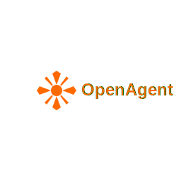

<div align="center">
  
  
  **OpenAgent - Open-source AI development assistant**
  
  [](https://github.com/RaheesAhmed/OpenAgent/stargazers)
  [](https://github.com/RaheesAhmed/OpenAgent/network)
  [](LICENSE)
  
  ## ℹ️ **IMPORTANT: Name Change Notice**
  
  **This project was previously named "OpenClaude" but has been rebranded to "OpenAgent" to avoid trademark conflicts with Anthropic's Claude brand. All functionality remains the same - we simply changed the name to ensure complete legal compliance and professional distribution.**
  
  ## ⚠️ **UNDER ACTIVE DEVELOPMENT - IN BETA**
  ## **SOME FEATURES MAY NOT WORK AS EXPECTED**
  
</div>

---

## 📋 Table of Contents

### 🚀 [Quick Start](#-quick-start)
### ✨ [Features](#-features)
### 📖 [Project Documentation](#-project-documentation)
### 🎮 [Slash Commands](#-slash-commands)
   - [📋 Core Commands](#-core-commands)
   - [🔄 Session Management](#-session-management)
   - [🛠️ Development Tools](#️-development-tools)
   - [💾 State Management](#-state-management)
   - [💡 Usage Examples](#-usage-examples)
### ⚙️ [Configuration](#️-configuration)
   - [Model Configuration](#model-configuration)
   - [MCP Server Configuration](#mcp-server-configuration)
   - [Custom AI Rules](#custom-ai-rules)
### 💬 [Usage Examples](#-usage-examples-1)
### 🏗️ [Project Structure](#️-project-structure)
### 🔧 [Built-in Capabilities](#-built-in-capabilities)
   - [File Operations (via MCP)](#file-operations-via-mcp)
   - [Development Tools](#development-tools)
### 🤝 [Contributing](#-contributing)
   - [Development Setup](#development-setup)
### 📄 [License](#-license)

---

## ✨ Features

🧠 **Smart Context Management** - Remembers your project state across sessions  
⚡ **Token Optimization** - Save costs with intelligent compression  
🛡️ **Code Validation** - Multi-layer quality checks for your code  
🔧 **MCP Integration** - Use any MCP server for extended functionality  
💾 **Persistent Memory** - Learn from your interactions and preferences  
🚀 **Real-time Streaming** - Professional interface with tool visibility  

---

## 📖 Project Documentation

### 📋 Complete Code Summary
For developers who want to understand the entire OpenAgent codebase quickly, we provide a comprehensive code summary:

**[📄 CODE_SUMMERY.md](CODE_SUMMERY.md)** - Complete project architecture, file relationships, and development guide

This document includes:
- 🏗️ **Complete Architecture Overview** - All 8 system layers explained
- 🔗 **File Relationships** - How every file connects and interacts
- 📊 **Code Quality Analysis** - Health metrics, dead code analysis, optimization opportunities
- 🎯 **Developer Onboarding** - Quick start checklist for new contributors
- 🛠️ **Modification Guide** - Exactly which files to change for different types of updates
- 📈 **Performance Metrics** - Project health score, token optimization insights


---

## 🚀 Quick Start

```bash
# Clone and setup
git clone https://github.com/RaheesAhmed/OpenAgent.git
cd OpenAgent
npm install
npm run build

# Set your API key
export ANTHROPIC_API_KEY="your-key-here"

# Start using OpenAgent
node ./dist/index.js
```

---

## 🎮 Slash Commands

OpenAgent includes a powerful set of **slash commands** for controlling your development session:

### 📋 **Core Commands**
- `/help` or `/h` or `/?` - Show all available commands
- `/status` or `/st` - Display agent status, metrics, and performance data
- `/version` or `/v` - Show OpenAgent version and model information
- `/exit` or `/quit` or `/q` - Clean shutdown and exit

### 🔄 **Session Management**
- `/reset` or `/clear` or `/restart` - Reset agent and clear conversation history
- `/new` or `/thread` - Create a new conversation thread
- `/history [threadId]` or `/hist` - Show conversation history for current or specified thread
- `/metrics` or `/stats` - Display detailed performance metrics

### 🛠️ **Development Tools**
- `/revert [steps]` or `/rv` - **Actually revert file changes** (deletes created files, undoes edits)
- `/undo` or `/u` - Undo the last agent action (same as `/revert 1`)
- `/diff [file]` or `/d` - Show all changes made by the agent with file previews
- `/config` or `/cfg` - View/update agent configuration

### 💾 **State Management**
- `/checkpoint create <name>` or `/cp create` - Create a restore point
- `/checkpoint list` or `/cp list` - List all available checkpoints
- `/checkpoint restore <name>` or `/cp restore` - Restore from saved checkpoint
- `/rollback [checkpoint]` or `/rb` - Rollback to previous stable state

### 💡 **Usage Examples**
```bash
# Check what the agent has been doing
/status

# See all file changes made
/diff

# Undo the last change (actually deletes/reverts files)
/undo

# Revert last 3 operations
/revert 3

# Create a checkpoint before major changes
/checkpoint create before-refactor

# View conversation history
/history

# Start fresh
/reset
```

**🔥 Real File Operations**: Unlike other AI assistants, OpenAgent's `/revert` and `/undo` commands **actually modify your filesystem** - deleting created files and reversing edits by analyzing the conversation history.

---

## ⚙️ Configuration

OpenAgent creates `.openagent/` folder with configuration files:

### Model Configuration
Edit `.openagent/config.json` to use any supported model:

```json
{
  "model": "anthropic:claude-sonnet-4-20250514",
  "temperature": 0.1,
  "maxTokens": 4000,
  "memoryEnabled": true,
  "streamingEnabled": true,
  "humanInLoopEnabled": true,
  "checkpointsEnabled": true
}
```

**Supported models:**
- `anthropic:claude-sonnet-4-20250514` (recommended)
- `anthropic:claude-3-5-sonnet-20241022`
- `anthropic:claude-3-opus-20240229`
- `openai:gpt-4`
- `openai:gpt-3.5-turbo`
- Any other LangChain universal model

### MCP Server Configuration
Add MCP servers in `.openagent/mcp-servers.json`:

```json
{
  "mcpServers": {
    "filesystem": {
      "command": "npx",
      "args": ["-y", "@modelcontextprotocol/server-filesystem", "/path/to/allowed/files"]
    },
    "context-engine": {
      "command": "npx", 
      "args": ["-y", "context-engine-mcp"]
    },
    "github": {
      "command": "npx",
      "args": ["-y", "@modelcontextprotocol/server-github"],
      "env": {
        "GITHUB_PERSONAL_ACCESS_TOKEN": "${GITHUB_TOKEN}"
      }
    }
  }
}
```

### Custom AI Rules
Set project-specific rules in `.openagent/rules.md`:

```markdown
# Project Rules

## Code Standards
- Use TypeScript for all new files
- Follow existing naming conventions
- Add JSDoc comments for public APIs

## Architecture
- Keep components small and focused
- Use proper error handling
- Write tests for new features

## Security
- Never commit secrets or API keys
- Validate all user inputs
- Use secure coding practices
```

---

## 💬 Usage Examples

```bash
# Basic conversation
You: Create a React login component

# File operations  
You: Read the package.json file
You: Create a new utils.ts file with helper functions

# Development tasks
You: Help debug this TypeScript error
You: Run npm test and show results
You: Optimize this SQL query for better performance
```

**What you'll see:**
```bash
⠋ OpenAgent is thinking (2s)...
🔧 read_file
🔧 create_file

✅ Created React login component with validation
💰 Cost: $0.0045 (1200 + 300 tokens)
📊 Tokens: 1200 in + 300 out = 1500 total
```

---

## 🏗️ Project Structure

```
.openagent/
├── config.json           # Model and behavior configuration
├── mcp-servers.json      # MCP server setup
├── rules.md              # Custom AI rules and guidelines
├── memory/               # Session and learning data
└── logs/                 # Operation logs

src/
├── agents/               # AI agent implementation
├── cli/                  # Command-line interface
├── core/                 # Context, memory, validation
├── mcp/                  # MCP client integration
└── tools/                # Built-in tools
```

---

## 🔧 Built-in Capabilities

### File Operations (via MCP)
- **Read files** - View content with syntax highlighting
- **Create/Edit files** - Generate or modify code files
- **Search & Replace** - Pattern-based text editing
- **Directory listing** - Browse project structure

### Development Tools
- **Terminal integration** - Execute commands safely
- **Code validation** - Check syntax and quality
- **Memory system** - Learn your preferences
- **Cost tracking** - Monitor API usage

---

## 🤝 Contributing

We welcome contributions! Please see our [Contributing Guide](CONTRIBUTING.md) for detailed instructions.

Quick steps:
1. Fork the repository
2. Create a feature branch
3. Make your changes
4. Add tests if needed
5. Submit a pull request

### Development Setup
```bash
git clone https://github.com/RaheesAhmed/OpenAgent.git
cd OpenAgent
npm install
npm run dev
```

---

## 📄 License

MIT License - see [LICENSE](LICENSE) for details.

---

<div align="center">

**[🐛 Report Bug](https://github.com/RaheesAhmed/OpenAgent/issues) • [💡 Request Feature](https://github.com/RaheesAhmed/OpenAgent/issues)**

*OpenAgent - Your configurable AI development assistant*

</div>
