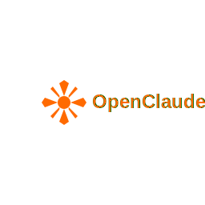

<div align="center">
  
  
  **OpenClaude - Open-source AI development assistant**
  
  [](https://www.typescriptlang.org/)
  [](https://nodejs.org/)
  [](https://www.anthropic.com/)
  [](LICENSE)
  
  ## ⚠️ **UNDER ACTIVE DEVELOPMENT - IN BETA**
  ## **SOME FEATURES MAY NOT WORK AS EXPECTED**
  
</div>

---

## ✨ Features

🧠 **Smart Context Management** - Remembers your project state across sessions  
⚡ **Token Optimization** - Save costs with intelligent compression  
🛡️ **Code Validation** - Multi-layer quality checks for your code  
🔧 **MCP Integration** - Use any MCP server for extended functionality  
💾 **Persistent Memory** - Learn from your interactions and preferences  
🚀 **Real-time Streaming** - Professional interface with tool visibility  

---

## 🚀 Quick Start

```bash
# Clone and setup
git clone https://github.com/RaheesAhmed/OpenClaude.git
cd OpenClaude
npm install
npm run build

# Set your API key
export ANTHROPIC_API_KEY="your-key-here"

# Start using OpenClaude
node ./dist/index.js
```

---

## ⚙️ Configuration

OpenClaude creates `.openclaude/` folder with configuration files:

### Model Configuration
Edit `.openclaude/config.json` to use any supported model:

```json
{
  "model": "anthropic:claude-sonnet-4-20250514",
  "temperature": 0.1,
  "maxTokens": 4000,
  "memoryEnabled": true,
  "streamingEnabled": true,
  "humanInLoopEnabled": true,
  "checkpointsEnabled": true
}
```

**Supported models:**
- `anthropic:claude-sonnet-4-20250514` (recommended)
- `anthropic:claude-3-5-sonnet-20241022`
- `anthropic:claude-3-opus-20240229`
- `openai:gpt-4`
- `openai:gpt-3.5-turbo`
- Any other LangChain universal model

### MCP Server Configuration  
Add MCP servers in `.openclaude/mcp-servers.json`:

```json
{
  "mcpServers": {
    "filesystem": {
      "command": "npx",
      "args": ["-y", "@modelcontextprotocol/server-filesystem", "/path/to/allowed/files"]
    },
    "context-engine": {
      "command": "npx", 
      "args": ["-y", "context-engine-mcp"]
    },
    "github": {
      "command": "npx",
      "args": ["-y", "@modelcontextprotocol/server-github"],
      "env": {
        "GITHUB_PERSONAL_ACCESS_TOKEN": "${GITHUB_TOKEN}"
      }
    }
  }
}
```

### Custom AI Rules
Set project-specific rules in `.openclaude/rules.md`:

```markdown
# Project Rules

## Code Standards
- Use TypeScript for all new files
- Follow existing naming conventions
- Add JSDoc comments for public APIs

## Architecture
- Keep components small and focused
- Use proper error handling
- Write tests for new features

## Security
- Never commit secrets or API keys
- Validate all user inputs
- Use secure coding practices
```

---

## 💬 Usage Examples

```bash
# Basic conversation
You: Create a React login component

# File operations  
You: Read the package.json file
You: Create a new utils.ts file with helper functions

# Development tasks
You: Help debug this TypeScript error
You: Run npm test and show results
You: Optimize this SQL query for better performance
```

**What you'll see:**
```bash
⠋ OpenClaude is thinking (2s)...
🔧 read_file
🔧 create_file

✅ Created React login component with validation
💰 Cost: $0.0045 (1200 + 300 tokens)
📊 Tokens: 1200 in + 300 out = 1500 total
```

---

## 🏗️ Project Structure

```
.openclaude/
├── config.json           # Model and behavior configuration
├── mcp-servers.json      # MCP server setup
├── rules.md              # Custom AI rules and guidelines
├── memory/               # Session and learning data
└── logs/                 # Operation logs

src/
├── agents/               # AI agent implementation
├── cli/                  # Command-line interface
├── core/                 # Context, memory, validation
├── mcp/                  # MCP client integration
└── tools/                # Built-in tools
```

---

## 🔧 Built-in Capabilities

### File Operations (via MCP)
- **Read files** - View content with syntax highlighting
- **Create/Edit files** - Generate or modify code files
- **Search & Replace** - Pattern-based text editing
- **Directory listing** - Browse project structure

### Development Tools
- **Terminal integration** - Execute commands safely
- **Code validation** - Check syntax and quality
- **Memory system** - Learn your preferences
- **Cost tracking** - Monitor API usage

---

## 🤝 Contributing

We welcome contributions! Please see our [Contributing Guide](CONTRIBUTING.md) for detailed instructions.

Quick steps:
1. Fork the repository
2. Create a feature branch
3. Make your changes
4. Add tests if needed
5. Submit a pull request

### Development Setup
```bash
git clone https://github.com/RaheesAhmed/OpenClaude.git
cd OpenClaude
npm install
npm run dev
```

---

## 📄 License

MIT License - see [LICENSE](LICENSE) for details.

---

<div align="center">

**[🐛 Report Bug](https://github.com/RaheesAhmed/OpenClaude/issues) • [💡 Request Feature](https://github.com/RaheesAhmed/OpenClaude/issues)**

*OpenClaude - Your configurable AI development assistant*

</div>
